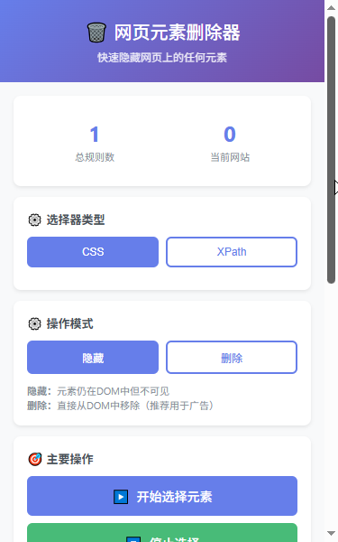
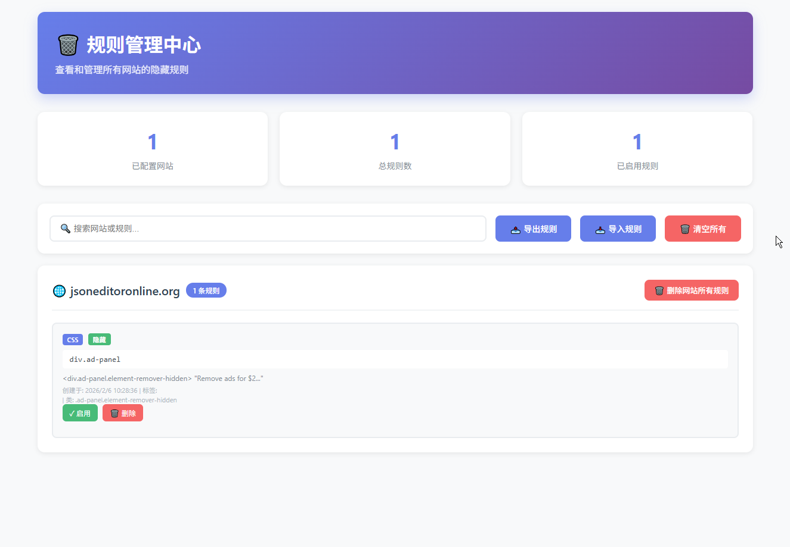

<div align="center">

# ✂️ Element Eraser

### 强大的网页元素移除工具 | Powerful Web Element Remover

[](LICENSE)
[](https://chrome.google.com/webstore)
[](https://github.com/trueai-org/element-eraser)
[](https://github.com/trueai-org/element-eraser/pulls)

一键删除网页上的任何元素 - 广告、弹窗、推荐内容，让网页更清爽！

*One-click removal of any web elements - ads, pop-ups, recommendations, for a cleaner web!*

</div>

---

## ✨ 功能特性

### 🎯 核心功能

- **🖱️ 点击删除** - 鼠标点击即可删除任何页面元素
- **💾 持久化规则** - 规则自动保存，刷新页面后依然生效
- **🔄 实时监听** - 自动处理动态加载的内容
- **🎨 双重模式** - 支持隐藏模式和删除模式
- **🖊 手动修改** - 支持手动添加和修改任意页面元素，例如：`#aswift_3_host`、`.adsbygoogle`、`//*[@id="aswift_0_host"]`

### 🛠️ 高级特性

- **📐 双选择器支持**
  - ✅ CSS 选择器 - 快速精准（支持 `#aswift_3_host`、`.adsbygoogle` 等）
  - ✅ XPath 表达式 - 强大灵活（支持 `//*[@id="aswift_0_host"]` 等）

- **📋 规则管理**
  - 可视化规则管理界面
  - 启用/禁用单条规则
  - 批量导入/导出规则
  - 按网站查看和管理

- **⚡ 性能优化**
  - MutationObserver 实时监听
  - CSS 注入高优先级样式
  - 多重隐藏策略确保生效
  - 定时重试处理延迟加载

### 🌟 用户体验

- **🎨 直观界面** - 简洁美观的弹出窗口
- **📊 统计信息** - 实时显示规则数量
- **🔍 搜索过滤** - 快速查找规则
- **💡 智能提示** - 实时显示选择器路径
- **🎯 高亮预览** - 悬停时高亮目标元素

---

## 📦 安装

### 方法一：从 Chrome 网上应用店安装（暂不上线）

> 🚧 即将上线 Chrome Web Store

### 方法二：开发者模式安装

1. **下载源码**
   ```bash
   git clone https://github.com/yourusername/element-eraser.git
   cd element-eraser
   ```

2. **打开 Chrome 扩展页面**
   - 访问 `chrome://extensions/`
   - 或点击 `⋮` → `更多工具` → `扩展程序`

3. **开启开发者模式**
   - 打开右上角的"开发者模式"开关

4. **加载扩展**
   - 点击"加载已解压的扩展程序"
   - 选择下载的 `element-eraser` 文件夹

5. **完成！**
   - 扩展图标将出现在工具栏中

---

## 🚀 使用指南

### 快速开始

1. **打开插件**
   - 点击工具栏中的 Element Eraser 图标

2. **选择模式**
   - **选择器类型**：CSS 或 XPath
   - **操作模式**：隐藏或删除

3. **开始选择**
   - 点击"开始选择元素"按钮
   - 在网页上移动鼠标，元素会被高亮
   - 点击要删除的元素

4. **完成**
   - 元素立即被隐藏/删除
   - 规则自动保存
   - 按 `ESC` 键退出选择模式

### 进阶使用

#### 🎨 选择器模式

- **CSS 选择器** - 适合大多数场景，速度快
- **XPath** - 适合复杂的 DOM 结构，功能强大

#### 🔧 操作模式

- **隐藏模式** - 元素保留在 DOM 中但不可见（推荐）
- **删除模式** - 直接从 DOM 中移除（用于顽固广告）

#### 📋 规则管理

1. 点击"查看和管理规则"
2. 查看所有网站的规则
3. 可以：
   - ✅ 启用/禁用规则
   - 🗑️ 删除单条规则
   - 🌐 删除整站规则
   - 🔍 搜索过滤规则
   - 📤 导出规则（备份）
   - 📥 导入规则（恢复）

### ⌨️ 快捷键

- `ESC` - 退出选择模式
- `Ctrl/Cmd + →` - 复制左到右（开发中）
- `Ctrl/Cmd + ←` - 复制右到左（开发中）

---

## 📸 截图

### 主界面


### 规则管理


---

## 🏗️ 技术栈

- **Manifest V3** - Chrome 扩展最新规范
- **Vanilla JavaScript** - 无依赖，纯原生 JS
- **Chrome Storage API** - 数据持久化
- **MutationObserver** - DOM 变化监听
- **CSS Injection** - 高优先级样式注入

---

## 🛠️ 开发

### 文件结构

```
element-eraser/
├── manifest.json          # 扩展配置文件
├── popup.html            # 弹出窗口页面
├── popup.js              # 弹出窗口逻辑
├── content.js            # 内容脚本（核心功能）
├── utils.js              # 工具函数
├── rules.html            # 规则管理页面
├── rules.js              # 规则管理逻辑
├── icon16.png            # 16x16 图标
├── icon48.png            # 48x48 图标
├── icon128.png           # 128x128 图标
└── README.md             # 项目说明
```

### 核心模块

#### 1. Content Script (`content.js`)
- 页面元素选择
- 规则应用和执行
- DOM 监听和处理
- 样式注入

#### 2. Popup (`popup.js`)
- 用户界面交互
- 模式切换
- 规则统计显示

#### 3. Rules Manager (`rules.js`)
- 规则可视化管理
- CRUD 操作
- 导入导出

#### 4. Utils (`utils.js`)
- CSS 选择器生成
- XPath 生成
- 工具函数

### 本地开发

1. **克隆仓库**
   ```bash
   git clone https://github.com/trueai-org/element-eraser.git
   cd element-eraser
   ```

2. **加载到 Chrome**
   - 打开 `chrome://extensions/`
   - 启用"开发者模式"
   - 点击"加载已解压的扩展程序"
   - 选择项目文件夹

3. **修改代码**
   - 编辑源文件
   - 在 `chrome://extensions/` 点击刷新按钮

4. **测试**
   - 在任意网页上测试功能
   - 检查控制台日志

### 调试技巧

```javascript
// 查看规则缓存
console.log('[元素删除器] 规则缓存:', rulesCache);

// 查看存储数据
chrome.storage.sync.get(['rules'], (result) => {
  console.log('存储的规则:', result.rules);
});

// 重新加载规则
loadAndApplyRules();
```

---

## 🤝 贡献指南

欢迎贡献代码！请遵循以下步骤：

### 代码规范

- 使用 ES6+ 语法
- 添加必要的注释
- 遵循现有代码风格
- 测试新功能

### 问题反馈

发现 Bug 或有功能建议？请[提交 Issue](https://github.com/trueai-org/element-eraser/issues)

---

## ❓ 常见问题 {#faq}

### Q: 刷新页面后规则会失效吗？
**A:** 不会！所有规则都会自动保存到本地存储，刷新后自动生效。

### Q: 可以删除广告吗？
**A:** 可以！使用"删除模式"可以彻底移除广告元素。

### Q: 规则会同步到其他设备吗？
**A:** 使用 `chrome.storage.sync`，登录同一 Google 账号的设备会自动同步。

### Q: 如何备份规则？
**A:** 在规则管理页面点击"导出规则"，保存 JSON 文件。

### Q: XPath 和 CSS 选择器有什么区别？
**A:** 
- **CSS 选择器** - 简单直观，性能更好，适合大多数场景
- **XPath** - 功能强大，可以处理复杂的 DOM 结构

---

## 📄 许可证

本项目采用 [MIT License](LICENSE) 开源协议。

---

## 🤖 AI 提示

此项目由 AI 辅助生成，请参考 AI 原始对话。

- https://github.com/copilot/share/c02a528a-08e4-8855-a050-a84a20e2401c